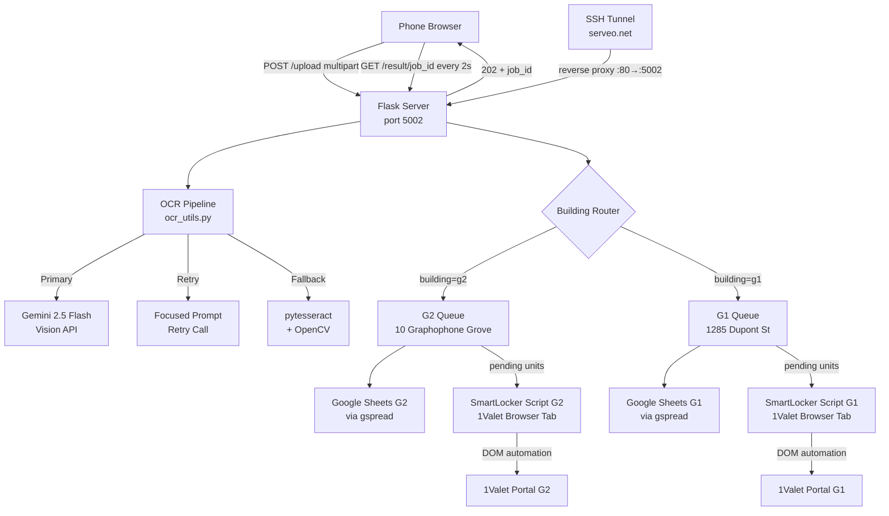
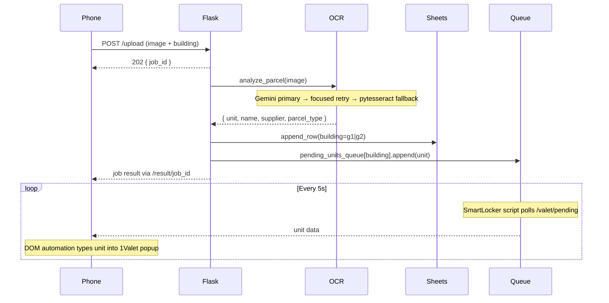
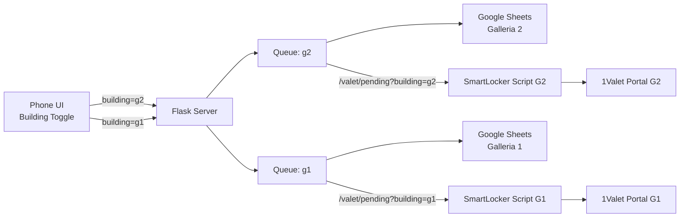
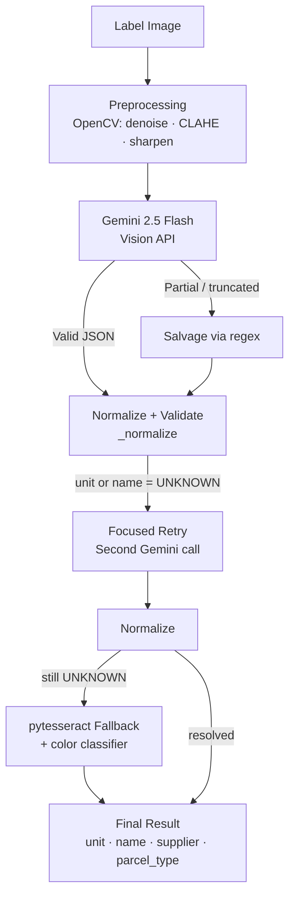

# ParcelVision — Automated Parcel Intake System

> Built by a CS student working part-time as a concierge. Reverse-engineered a proprietary smart locker system with no public API, no vendor SDK, and no documentation. Approved by the property manager and deployed across two residential buildings.

---

## Overview

ParcelVision automates parcel intake at multi-building residential properties. Concierge staff photograph shipping labels from a mobile browser — the system extracts the unit number, recipient name, courier, and parcel type, logs to Google Sheets, and queues the unit for automatic entry into the 1Valet smart locker portal.

**Full cycle: under 15 seconds. Zero manual re-entry.**

---

## Live UI

<div align="center">

| Upload Screen | Extraction Result |
|:---:|:---:|
| Mobile-first dark UI | Real-time result card |
| Camera capture + drag-and-drop | Unit · Name · Courier · Parcel Type |
| Building toggle (G1 / G2) | Auto-logged to Google Sheets |

</div>

The interface is served by Flask and accessible from any phone on the network or via public SSH tunnel — no app install required.

---

## Architecture



---

## Upload Pipeline



---

## Multi-Building Routing



Each building has its own Google Sheet, service account credentials, and 1Valet session. They share one Flask server on one machine — fully isolated at the queue and data layer.

---

## OCR Pipeline



**Parcel type classification:**

| Type | Detected as |
|---|---|
| Amazon blue poly mailer | PRIME BLUE PACKAGE |
| Amazon orange packaging | PRIME ORANGE PACKAGE |
| Amazon cardboard box | AMAZON BOX |
| Brown cardboard box | BROWN BOX |
| White / black / blue / pink / grey soft bag | `<COLOR> PACKAGE` |
| White / black / blue / pink box | `<COLOR> BOX` |
| Transparent poly bag | CLEAR PACKAGE |

---

## 1Valet Integration — No API Required

1Valet has no public API. Integration was built by reverse-engineering the browser interface:

1. **DOM inspection** — identified the suite input field by placeholder text, dropdown options by text content and bounding box visibility
2. **Event simulation** — `input`, `change`, and `keydown` events dispatched in sequence to trigger 1Valet's React state updates
3. **Polling queue** — Flask maintains a per-building queue; the injected script polls every 5 seconds, processes one unit at a time, and calls `/valet/complete` to dequeue
4. **Re-focus logic** — after each unit is entered, the input field is re-focused so the popup stays open for the next entry

The script is self-contained — copy it from `smartlockerscript.txt` (G2) or `smartlockerscript_g1.txt` (G1) and paste into the 1Valet browser tab console.

---

## Tech Stack

| Layer | Technology |
|---|---|
| Backend | Python · Flask · Flask-SocketIO |
| Vision / OCR | Gemini 2.5 Flash · OpenCV · pytesseract |
| Image preprocessing | OpenCV (CLAHE · denoise · sharpen) |
| Data logging | Google Sheets · gspread · oauth2client |
| Browser automation | Vanilla JS · DOM introspection · event simulation |
| Tunnel / ingress | serveo.net SSH reverse proxy (zero config) |
| Async jobs | Threading · in-memory dict queue · HTTP polling |
| Frontend | HTML · CSS · Vanilla JS (no framework) |
| Environment | Windows · Git Bash · Python venv |

---

## Buildings

| ID | Building | Sheet | Script |
|---|---|---|---|
| `g2` | Galleria 2 — 10 Graphophone Grove | `credentials.json` | `smartlockerscript.txt` |
| `g1` | Galleria 1 — 1285 Dupont St | `credentials_g1.json` | `smartlockerscript_g1.txt` |

---

## Project Structure

```
ParcelVision/
  start.sh                      one-command startup: tunnel + Flask + URL stamp
  backend/
    app2.py                     Flask server — /upload, /result, /valet endpoints
    ocr_utils.py                Vision pipeline: Gemini → retry → pytesseract
    vision_utils.py             Thin wrapper around ocr_utils
    sheet_utils.py              Google Sheets writer — dual-building support
    smartlockerscript.txt       G2 browser automation (SERVER_URL stamped at runtime)
    smartlockerscript_g1.txt    G1 browser automation
    templates/index.html        Mobile upload UI — dark, camera-first
    requirements.txt
    .env                        API keys — not committed
    credentials.json            G2 service account — not committed
    credentials_g1.json         G1 service account — not committed
    uploads/                    Saved label images
```

---

## Setup

**1. Clone and install**

```bash
git clone https://github.com/blacks1k-sc/ParcelVision.git
cd ParcelVision/backend
python -m venv venv
source venv/Scripts/activate   # Windows Git Bash
pip install -r requirements.txt
```

**2. Create `backend/.env`**

```env
GEMINI_API_KEY=your_key_here

# Galleria 2
SHEET_ID=your_g2_sheet_id
WORKSHEET_NAME=PACKAGES NEW

# Galleria 1
G1_SHEET_ID=your_g1_sheet_id
G1_WORKSHEET_NAME=PACKAGES NEW
G1_CREDENTIALS_PATH=credentials_g1.json
```

**3. Add service account credentials**

Drop `credentials.json` (G2) and `credentials_g1.json` (G1) into `backend/`. Share each Google Sheet with the corresponding service account email.

**4. Start**

```bash
./start.sh
```

This creates an SSH tunnel via serveo.net, stamps the public URL into both SmartLocker scripts, and starts Flask on port 5002. The terminal prints the public URL for the phone.

**5. 1Valet automation**

Open the 1Valet "Add Delivery" popup in the browser tab, then paste the contents of `smartlockerscript.txt` (G2) or `smartlockerscript_g1.txt` (G1) into the browser console. The listener auto-starts in 3 seconds.

---

## Deployment Note

This runs on a Windows concierge desk PC via Git Bash. Flask is exposed publicly via a free serveo.net SSH tunnel — no cloud infrastructure, no DNS config, no cost. The system has been running in production across two residential buildings since deployment.
